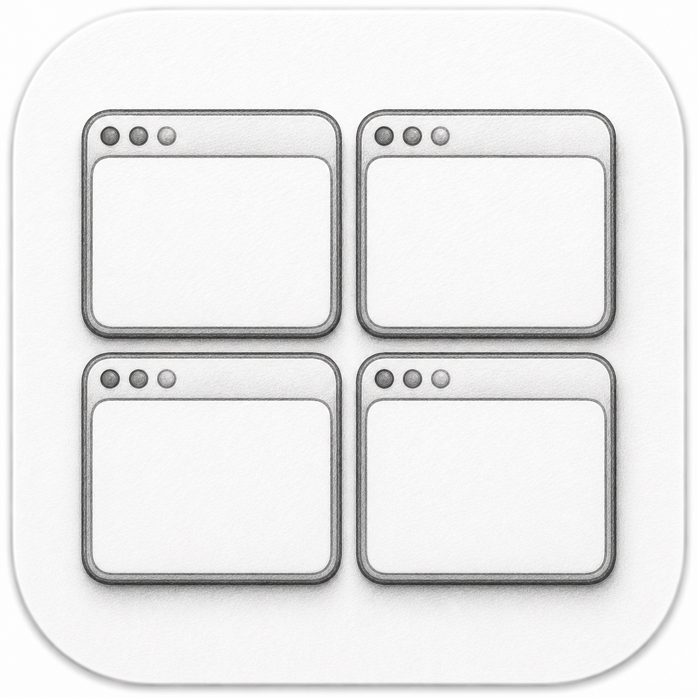

<p align="center">
  
</p>

# My Window Manager

[한국어](README.ko.md)

A macOS native window manager with a visual editor. Snap the front window to
saved rectangles, cycle through layouts, and batch-place multiple apps across
monitors — all driven by global hotkeys.

## Features

- **Resize presets** — the front window snaps to a saved rectangle. Mix ratio
  and px per dimension (e.g. "Left half + height 200px").
- **Cycles** — step the front window through a sequence of presets with one hotkey.
- **Layouts** — multi-app, multi-monitor batch placement. Auto-launches apps if needed.
- **Visual editor** — drag to draw regions on a monitor canvas, fine-tune with
  numeric inputs. Unit (ratio/px) is per-dimension.
- **Global hotkeys** — assign any modifier+key combo to each preset / cycle / layout.
- **Config backup** — export/import all presets, cycles, and layouts as JSON.

## Raycast Quicklinks

Install the companion Raycast extension, then use `Raycast에 추가` beside a
preset, cycle, layout, move action, or size action. Save the prefilled
Quicklink in Raycast to make the item searchable from Root Search.
The button also copies the direct app link to the clipboard as a fallback when
the companion extension is unavailable.

Quicklinks use stable item IDs, so renaming an item does not break execution.
Raycast does not expose Quicklink rename APIs, so rename the Quicklink in
Raycast separately when you rename an item in My Window Manager.

## Install

1. Download the latest `My-Window-Manager-vX.Y.Z.zip` from [Releases](../../releases) and unzip it.
2. Move `My Window Manager.app` to your Applications folder and open it.
3. **First launch:** macOS will block the app (it is not notarized). Go to
   System Settings > Privacy & Security and click **"Open Anyway"**, then confirm.
4. Grant Accessibility permission when prompted (System Settings >
   Privacy & Security > Accessibility).

The app checks GitHub Releases for updates at launch and every 24h; when a
newer version exists it offers to download and self-update in place. You can
also trigger it manually via the menu bar → "업데이트 확인...".

## Requirements

- macOS 13+
- Accessibility permission (System Settings > Privacy & Security > Accessibility)

## Build from source

```sh
make app          # builds "dist/My Window Manager.app"
make run          # build and launch
make release      # builds the distributable zip

# Release flow:
make bump-minor   # bump version in Info.plist + commit
make publish      # zip + tag + push + GitHub release (gh CLI)
```

Note: locally built bundles are signed with a self-signed identity
("MyWindowManager Dev"), so Accessibility permission must be granted once per
identity. Create one in Keychain Access (Certificate Assistant > Create a
Certificate, type: Code Signing) and the grant persists across rebuilds; set
`WM_SIGN_IDENTITY` to use a different name. See
[docs/smoke-test.md](docs/smoke-test.md) for the manual verification checklist.

## Config

`~/Library/Application Support/MyWindowManager/config.json`
